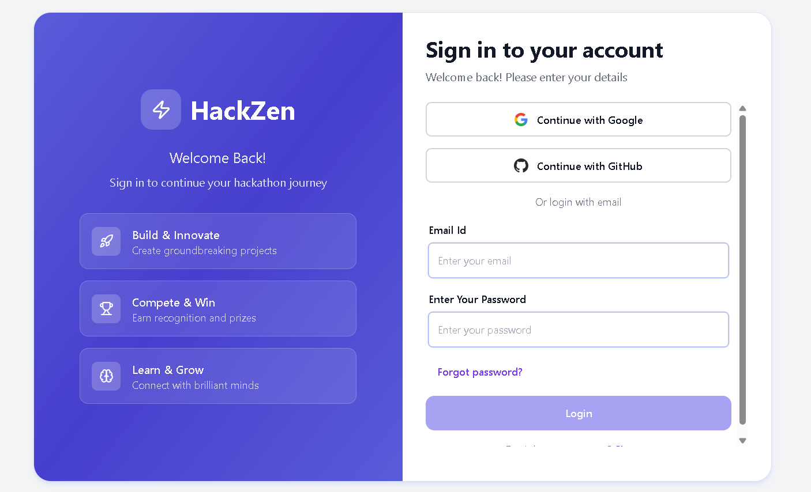
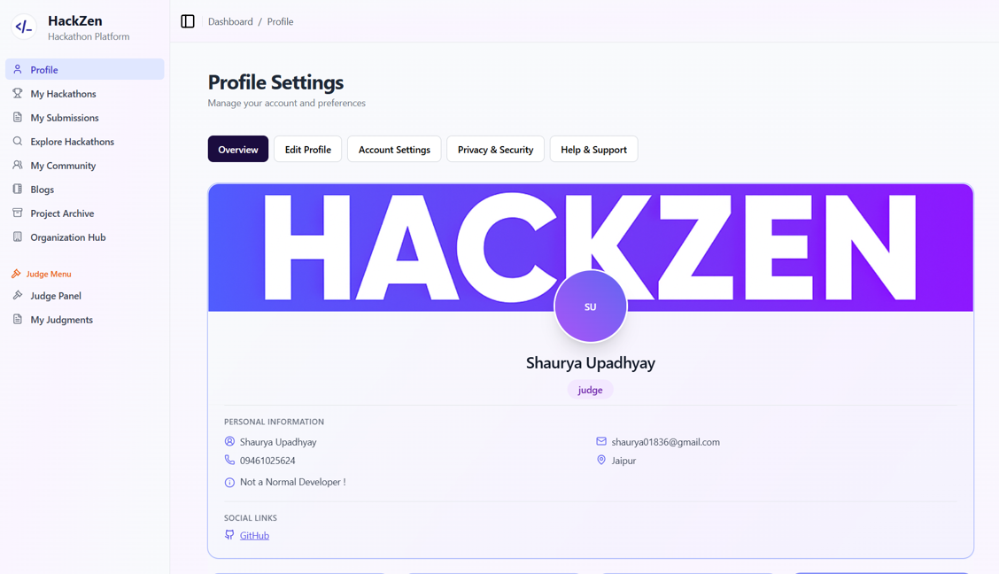
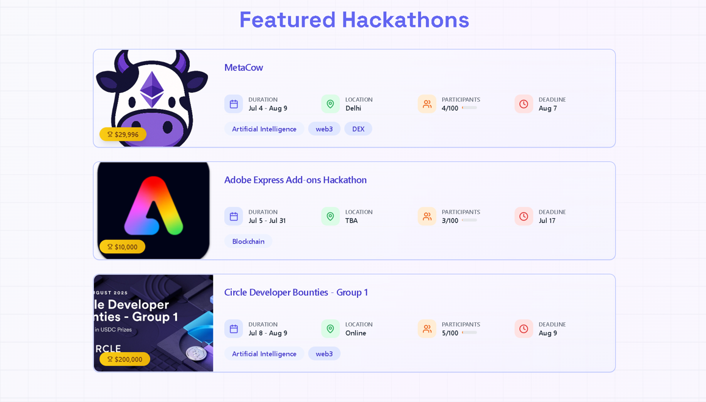
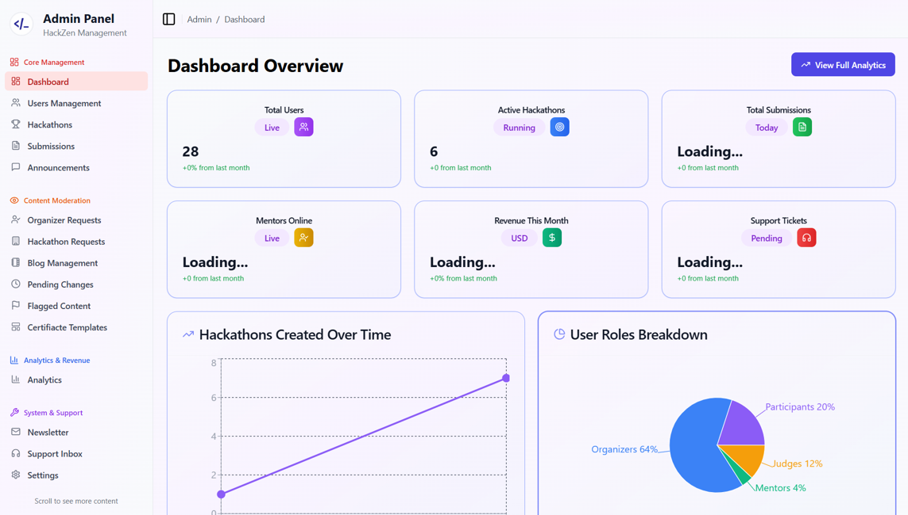
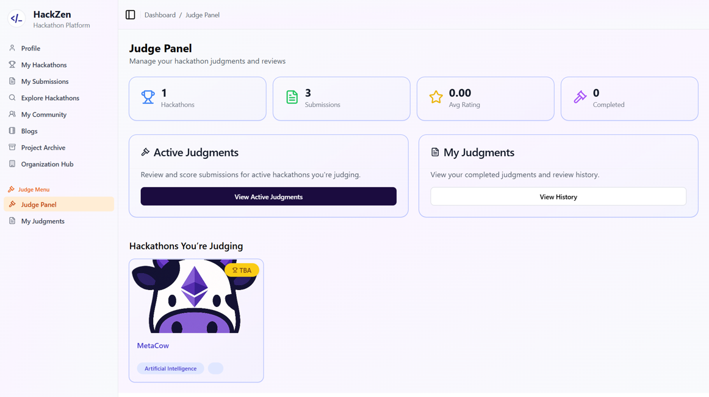

# HackZen

**A full-stack hackathon management platform** — discover hackathons, form teams, submit projects, and manage events as organizers, judges, or participants.

> **Note:** This is a **group project**. The original repository is owned by a teammate; this is my fork. My contributions are documented in the [My Contributions](#my-contributions) section below.

---

## Table of Contents

- [Overview](#overview)
- [Screenshots](#screenshots)
- [Technologies Used](#technologies-used)
- [Features](#features)
- [My Contributions](#my-contributions)
- [Project Structure](#project-structure)
- [Getting Started](#getting-started)
- [Environment Variables](#environment-variables)
- [API Overview](#api-overview)
- [License](#license)
- [Author](#author)

---

## Overview

HackZen is a web application that connects hackathon organizers, judges, mentors, and participants. It supports:

- **Participants:** Browse hackathons, register, form teams, submit projects, and track progress.
- **Organizers:** Create and manage hackathons, teams, problem statements, and judge assignments.
- **Judges:** Evaluate submissions, score projects, and manage problem statements.
- **Admins:** User management, analytics, announcements, and platform-wide settings.

The app uses a **REST API** backend with **JWT** and **OAuth** (GitHub, Google) for authentication, and a **React** frontend with role-based dashboards.

---

## Screenshots

### Featured — Landing Page

<p align="center">
  
</p>

*First impression: HackZen landing page.*

---

### Auth & Discovery

| Login (Email + GitHub / Google) | User Dashboard |
|----------------------------------|----------------|
|  |  |

| Explore Hackathons | Hackathon Detail |
|--------------------|------------------|
|  |  |

---

### Admin Panel

<p align="center">
  
</p>

---

### Organizer & Judge panels

| Organizer Dashboard | Judge Panel |
|---------------------|-------------|
|  |  |

---

## Technologies Used

### Backend

| Category | Technology |
|----------|------------|
| **Runtime** | Node.js |
| **Framework** | Express.js |
| **Database** | MongoDB (Mongoose) |
| **Auth** | JWT, Passport.js (Local, **GitHub OAuth**, **Google OAuth**) |
| **2FA** | Speakeasy, QRCode |
| **Session** | express-session, connect-mongo |
| **Real-time** | Socket.IO |
| **File upload** | Multer, Cloudinary |
| **Email** | SendGrid, Nodemailer, Resend |
| **Validation** | Custom validators, Mongoose schemas |

### Frontend

| Category | Technology |
|----------|------------|
| **Framework** | React 18 |
| **Build** | Vite |
| **Routing** | React Router v7 |
| **UI** | Tailwind CSS, Radix UI, Framer Motion, Lucide React |
| **State / API** | Context API, Axios, fetch |
| **Real-time** | Socket.IO client |
| **Rich text** | TipTap, React Quill |

### DevOps & Tools

- **Hosting:** Vercel (frontend), Render (backend)
- **Version control:** Git, GitHub

---

## Features

- **Authentication**
  - Email/password registration and login
  - **GitHub** and **Google** OAuth login
  - JWT-based API auth and session handling
  - Two-factor authentication (2FA) with TOTP
  - Forgot / reset password with email tokens
- **Roles:** Participant, Organizer, Mentor, Judge, Admin with role-based routes and UI
- **Hackathons:** CRUD, registration, teams, problem statements, rounds
- **Submissions:** Project submissions, PPT uploads (Cloudinary), submission history
- **Judging:** Judge assignments, scoring, problem statement management
- **Teams:** Create/join teams, team invites
- **Notifications & badges:** In-app notifications, achievement badges
- **Organizations:** Organization invites and domain validation
- **Real-time:** Socket.IO for chat (e.g. sponsor proposals) and live updates
- **Admin:** User management, analytics, announcements, newsletter, certificate pages

---

## My Contributions

*This section describes my work on the project. The codebase is a result of team effort; the following highlights my primary areas of contribution.*

### Backend & APIs

- **REST API design and implementation**  
  Designed and implemented REST endpoints for users, hackathons, teams, submissions, scores, notifications, badges, organizations, judge management, and related resources.
- **Authentication & authorization**
  - **GitHub OAuth:** Passport GitHub strategy, callback handling, user create/link, JWT issue, redirect state.
  - **Google OAuth:** Passport Google strategy, callback handling, user create/link, JWT issue, redirect state.
  - **JWT middleware:** `protect`, `isAdmin`, `isOrganizerOrAdmin`, `isJudge` for securing routes.
  - **Session:** express-session with MongoDB store, CORS and cookie configuration for production (e.g. Vercel + Render).
- **Two-Factor Authentication (2FA)**  
  Implemented 2FA routes and logic (generate, verify, disable, status, 2FA login) using Speakeasy and QRCode.
- **User & auth flows**  
  Registration, email verification, login, logout, forgot/reset password, OAuth registration completion (`/oauth-register`), profile completion, and role-based endpoints (e.g. `/me`, `/me/judge-hackathons`, `/me/saved-hackathons`).
- **Database & models**  
  Worked with Mongoose schemas and models (User, Hackathon, Team, Submission, Score, etc.) and ensured consistency with API contracts.
- **Integrations**  
  SendGrid/Resend for emails, Cloudinary for uploads, Socket.IO for real-time features; health and diagnostic endpoints (e.g. `/api/health`, `/api/test-sendgrid`).

### Frontend–Backend Integration

- **API client and config**  
  Centralized API base URL, auth headers (`getAuthHeaders`), and helpers (`buildApiUrl`) in `Frontend/src/lib/api.js`.
- **Auth context**  
  Integrated login, logout, OAuth redirect handling (token in URL), token storage, and role-based redirects with the backend (JWT and session).
- **Feature-specific API usage**  
  Wired frontend to backend for PPT uploads, submissions, participants, teams, problem statements, judge management, and other REST endpoints used across dashboards and forms.

### Frontend (partial)

- Contributed to **auth flows** (login, registration, OAuth success page) and **API consumption** from React components.
- Worked on **role-based routing** and **private routes** so dashboards and pages align with backend roles.

### Other

- **CORS and environment setup** for local and production (e.g. Vercel + Render).
- **Documentation and structure** (e.g. README, project structure, env notes) to keep the repo clear and recruiter-friendly.

---

## Project Structure

```
HackZen/
├── backend/                 # Node.js + Express API
│   ├── config/              # Passport (GitHub/Google), Socket.IO, Cloudinary, mailer
│   ├── controllers/        # Request handlers (user, hackathon, team, submission, etc.)
│   ├── middleware/          # Auth (JWT), trackStreak, validators, Cloudinary upload
│   ├── model/               # Mongoose models
│   ├── routes/              # API routes (users, 2fa, hackathons, teams, etc.)
│   ├── schema/              # Mongoose schemas
│   ├── services/            # Email service
│   ├── templates/           # Email templates
│   └── index.js             # App entry, CORS, session, Passport, routes, Socket.IO
├── Frontend/                # React + Vite app
│   ├── src/
│   │   ├── components/      # UI, layout, auth, dashboard components
│   │   ├── context/         # AuthContext
│   │   ├── hooks/           # Custom hooks
│   │   ├── lib/             # api.js (API config & helpers)
│   │   ├── pages/           # Pages (Auth, Dashboard, Admin, etc.)
│   │   └── utils/           # roleBasedRouting, socket, etc.
│   └── public/
├── docs/
│   └── screenshots/         # Screenshots for README
└── README.md
```

---

## Getting Started

### Prerequisites

- Node.js (v18+ recommended)
- MongoDB (local or Atlas)
- Git

### Backend

```bash
cd backend
npm install
# Create .env (see Environment Variables)
npm run dev
```

Server runs at `http://localhost:3000` by default.

### Frontend

```bash
cd Frontend
npm install
# Create .env / .env.local if needed (e.g. VITE_API_URL)
npm run dev
```

App runs at `http://localhost:5173` by default.

### Production

- **Frontend:** Built with `npm run build` (e.g. deployed on Vercel).
- **Backend:** `npm start` (e.g. deployed on Render). Set `NODE_ENV=production` and all required env vars.

---

## Environment Variables

### Backend (`backend/.env`)

| Variable | Description |
|----------|-------------|
| `MONGO_URL` | MongoDB connection string |
| `JWT_SECRET` | Secret for JWT signing |
| `SESSION_SECRET` | Session encryption secret |
| `GITHUB_CLIENT_ID` / `GITHUB_CLIENT_SECRET` | GitHub OAuth app |
| `GITHUB_CALLBACK_URL` | e.g. `http://localhost:3000/api/users/github/callback` |
| `GOOGLE_CLIENT_ID` / `GOOGLE_CLIENT_SECRET` | Google OAuth credentials |
| `GOOGLE_CALLBACK_URL` | e.g. `http://localhost:3000/api/users/google/callback` |
| `FRONTEND_URL` | Frontend origin (e.g. `https://hackzen.vercel.app`) |
| `SENDGRID_API_KEY` (or similar) | Email sending |
| `CLOUDINARY_*` | Cloudinary config for uploads |

### Frontend

| Variable | Description |
|----------|-------------|
| `VITE_API_URL` | Backend API URL (e.g. `http://localhost:3000` or production API URL) |

---

## API Overview

Base URL: `/api`

| Area | Examples |
|------|-----------|
| **Auth / Users** | `POST /users/register`, `POST /users/login`, `GET /users/github`, `GET /users/google`, `GET /users/me`, `POST /users/oauth-register` |
| **2FA** | `POST /users/2fa/generate`, `POST /users/2fa/verify`, `POST /users/2fa/login` |
| **Hackathons** | `GET|POST /hackathons`, `GET /hackathons/:id` |
| **Teams** | `GET|POST /teams`, `GET /teams/hackathon/:hackathonId` |
| **Submissions** | `GET|POST /submissions`, `POST /submission-form/ppt` |
| **Scores** | `GET|POST /scores` |
| **Notifications** | `GET|PATCH /notifications` |
| **Badges** | `GET /badges`, `POST /badges/check` |
| **Organizations** | `GET /organizations`, `POST /users/invite` |
| **Judge management** | `GET|POST /judge-management/...` |
| **Health** | `GET /health`, `GET /test-sendgrid` |

All protected routes use the `Authorization: Bearer <token>` header.

---

## License

This is a group project; credit the team and original repository owner when sharing or forking.

---

## Author

**Gaurav Jain**

| | |
|--|--|
| **Portfolio** | [gauravjain.tech](https://www.gauravjain.tech/) |
| **GitHub** | [@gauravjain0377](https://github.com/gauravjain0377) |
| **LinkedIn** | [Gaurav Jain](https://www.linkedin.com/in/this-is-gaurav-jain/) |
| **Twitter / X** | [@gauravjain0377](https://x.com/gauravjain0377) |

---